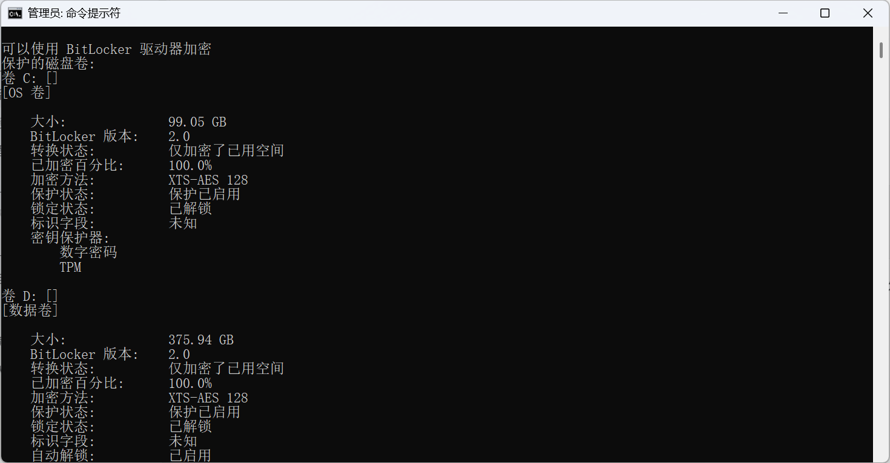
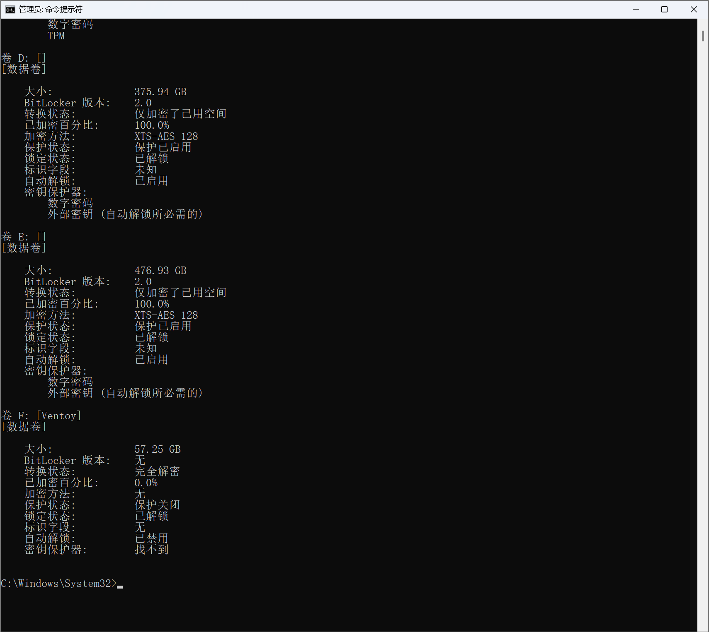
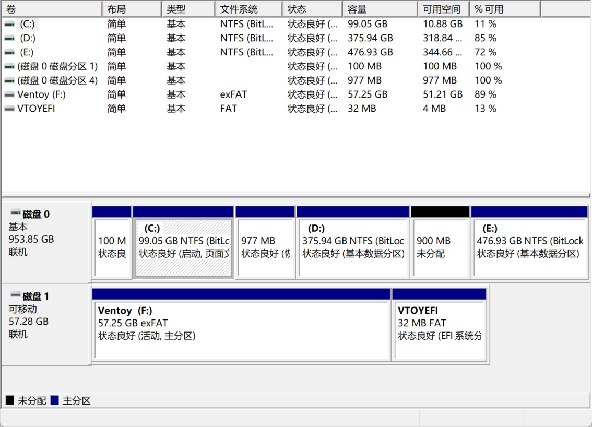
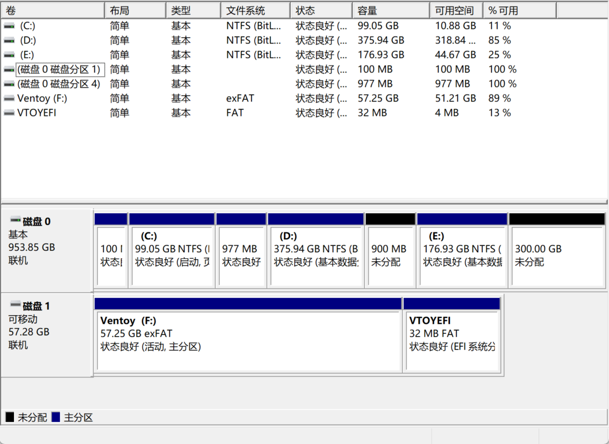

# Windows + Ubuntu 双系统安装与装错版本后的重装指南

> 整理日期：2026-09-07。目标：保留 Windows，安装准确的 **Ubuntu 22.04.4 Desktop AMD64**，并说明如何替换已安装的新版 Ubuntu。
>
> 本文基于一次真实安装对话、用户截图和官方资料。已确认：Windows 使用 UEFI；C/D/E 开启 BitLocker；从 E 盘分出 300GB；旧 Ubuntu 已装入独立 ext4 分区并能启动。**尚未收到成功重装 22.04.4 的验证结果**。重装章节是按已核实布局给出的操作方案，不冒充已完成记录。

## 目录与阅读路线

- [1. 先分清内存、分区和安装镜像](#concepts)
- [2. 下载准确版本及准备材料](#prepare)
- [3. Windows：检查启动模式和 BitLocker](#windows)
- [4. 分配 300GB 硬盘空间](#space)
- [5. 制作 Ventoy 启动 U 盘](#ventoy)
- [6. 从 U 盘启动与 Secure Boot 排障](#boot)
- [7. 首次安装 Ubuntu](#install)
- [8. 已装错版本：替换成 22.04.4](#reinstall)
- [9. 重启与双系统验收](#verify)
- [10. 本次常见问题](#faq)
- [11. 只读检查命令与最终核对](#checks)
- [12. 来源和图片说明](#sources)

**首次安装**按第 2～7、9 节操作；**已经安装错版本**先读第 8 节，不要再次压缩或删除 E 盘。

<a id="concepts"></a>
## 1. 先分清内存、分区和安装镜像

### 1.1 运行内存不是硬盘容量

- **RAM（运行内存）**是程序运行时使用的空间。本次 `free -h` 照片中总量约 30GiB、已用约 2.3GiB，是正常系统占用。双系统切换启动时不必把 RAM 永久分成两半。
- **硬盘空间**用于保存系统、软件和文件。本次给 Ubuntu 的 **300GB** 属于这一类。
- **swap（交换空间）**是内存辅助空间。照片中的 8GiB swap 不代表系统分区大小，也不要求新安装照建 8GB swap 分区。

查内存用 `free -h`；查当前 Ubuntu 系统分区容量用 `df -h /`；查磁盘布局用 `lsblk`。

### 1.2 C、D、E 不一定是三块硬盘

本次 C/D/E 都位于同一块约 1TB 内部硬盘。Windows 显示“磁盘 0”，Linux 显示 `/dev/nvme0n1`。

从 E 盘压缩出的 300GB 是独立未分配空间。安装后 Ubuntu 使用自己的分区，**不在剩余 E 盘的某个文件夹里**。

### 1.3 ISO、Ventoy、试用系统与已安装系统

ISO 是安装镜像；Ventoy 让 U 盘能够启动镜像。复制 ISO 只代表准备好了安装介质，**不代表完成安装**。

“Try Ubuntu”是从 U 盘启动的试用环境。安装到硬盘后，拔掉 U 盘仍能启动的才是已安装系统。删除 U 盘里的旧 ISO 不会卸载硬盘中的 Ubuntu；换 ISO 也不会自动降级旧系统。

<a id="prepare"></a>
## 2. 下载准确版本及准备材料

### 2.1 先确认版本，再下载

本次最初误下载并安装了 26 系列，之后明确需要 **22.04.4**。22.04、22.04.4、22.04.5 的要求精度不同。课程指定 22.04.4 时，应按指定版本准备，不用其他维护版本替代。

官方文件：

- [Ubuntu 22.04.4 归档目录](https://old-releases.ubuntu.com/releases/22.04.4/)
- [Ubuntu 22.04.4 桌面版 ISO 直接下载](https://old-releases.ubuntu.com/releases/22.04.4/ubuntu-22.04.4-desktop-amd64.iso)
- [SHA256SUMS 校验文件](https://old-releases.ubuntu.com/releases/22.04.4/SHA256SUMS)

文件名必须为：

```text
ubuntu-22.04.4-desktop-amd64.iso
```

`desktop` 表示桌面版；`amd64` 适用于通常的 64 位 Intel/AMD PC，不是仅支持 AMD。不要用 server、ARM、WSL、torrent 文件代替该 ISO。

可在 Windows PowerShell 检查文件完整性，把示例路径换为实际下载位置：

```powershell
Get-FileHash -Algorithm SHA256 -LiteralPath 'D:\Downloads\ubuntu-22.04.4-desktop-amd64.iso'
```

对比官方 `SHA256SUMS` 中**同一文件名**的哈希。复制到 U 盘后也可以检查目标文件，确认复制完整。

### 2.2 安装更新与版本显示

需要先得到镜像原始的 22.04.4 环境时，安装阶段先断网、不选“安装时下载更新”。后续正常更新可能让版本显示成为较新的 **22.04.x**，这与跨到 24.04/26.04 的发行版升级不同。

不要为了永久保留“22.04.4”字符串而长期关闭安全更新。若课程严格依赖内核或软件版本，应记录 `uname -r` 和关键软件版本，再根据项目要求管理环境；同一个系统版本字符串不保证软件环境完全一致。

### 2.3 材料清单

- 容量足够的 U 盘，16GB 或以上较宽裕；本次使用约 64GB U 盘。
- 需要保留的 Windows 文件备份；重装还需备份旧 Ubuntu 文件。
- 手机或其他设备上可查看的 BitLocker 恢复密钥。
- 电源连接稳定；保存正在做的工作；把本指南放到手机上方便重启时查看。

<a id="windows"></a>
## 3. Windows：检查启动模式和 BitLocker

### 3.1 查 BIOS 模式

1. 按 `Win + R`，输入 `msinfo32` 并回车。
2. 在“系统摘要”找到“BIOS 模式”。
3. 本次结果是 **UEFI**，因此 Ubuntu 安装 U 盘也应以 UEFI 模式启动。

曾把命令写成 `msifo32`，少了一个 `n`。正确的是 **msinfo32**。

若结果是“传统/Legacy”，不要直接禁用 CSM 或强行改 UEFI，先核对现有 Windows 的启动配置。双系统应保持启动模式一致。[Ubuntu UEFI 说明](https://help.ubuntu.com/community/UEFI)

### 3.2 如何打开管理员命令提示符

1. 按 `Win + S`，输入 `cmd`，先不按回车。
2. 在**搜索结果中的“命令提示符”**上右键。
3. 选择“以管理员身份运行”，权限提示点“是”。若要求管理员密码，需要有权限的账户。
4. 标题通常显示“管理员：命令提示符”。

另一个入口是 `Win + X → 终端（管理员）`，名称可能随版本不同。

**别点错：**右键黑色窗口的标题栏打开的是字体、颜色等属性，不会变成管理员；设置中的“系统 → 高级 → 终端”也不是管理员启动入口。不需要开启 sudo 或开发人员模式。

### 3.3 查询加密状态

在管理员窗口输入：

```bat
manage-bde -status
```

等各卷信息输出完成。只有工具标题或输出为空，不能据此认定没加密；出现“拒绝访问”则重新检查管理员权限。该命令只查询状态，不显示 48 位恢复密码。[Microsoft manage-bde 说明](https://learn.microsoft.com/en-us/windows-server/administration/windows-commands/manage-bde)

本次结果：C、D、E 都是加密百分比 100%、保护已启用；F 盘 Ventoy 完全解密、0%、保护关闭。



*图 1：已成功以管理员身份查询。C、D 的“已解锁”不表示加密已关闭。*



*图 2：E 盘加密，Ventoy U 盘未加密。截图拍摄于压缩 E 盘之前。*

理解三个区别：

- **已解锁**：当前 Windows 能读取该卷。
- **暂停保护/保护关闭**：不能仅凭此项断定数据已解密。
- **完全解密 + 0%**：该卷解密已完成。

备份恢复密钥也不会关闭加密。

### 3.4 保存恢复密钥；管理入口闪退怎么办

常规入口是“管理 BitLocker → 对应卷 → 备份恢复密钥”。设置里也可能有“隐私和安全性 → 设备加密 → BitLocker 驱动器加密/查找恢复密钥”。Windows 版本不同，界面会有差异。

本次遇到搜索无结果、管理入口闪退。**仅凭闪退不能确定原因，也不能证明磁盘加密失效。** 可先通过浏览器打开 [微软账户恢复密钥页面](https://account.microsoft.com/devices/recoverykey)，登录电脑使用的账户；工作/学校设备向所属组织查询。

保存与本机及相应卷匹配的记录。恢复界面若显示密钥 ID，应按 ID 匹配。C/D/E 可能各有不同密钥。截图保存在手机等电脑之外，**不要上传 GitHub 或发到聊天**。本指南没有附恢复密钥图片。[Microsoft 设备加密说明](https://support.microsoft.com/en-us/windows/security/encryption/device-encryption-in-windows)

### 3.5 是否必须解密

如果安装器提示 BitLocker 阻止继续并排安装，应退出，回 Windows 关闭相关加密并等待解密完成，再重新安装。**不要通过“擦除磁盘”绕过提示。** [Ubuntu BitLocker 安装说明](https://ubuntu.com/desktop/docs/en/latest/reference/bitlocker-during-ubuntu-installation/)

对应卷的管理界面可提供“关闭 BitLocker”；“设备加密”也可能有总开关。关闭前确认影响哪些卷、恢复密钥已保存，以及 Windows 版本是否允许以后重新启用。关闭会降低相关数据在设备丢失时的保护，不应把所有卷解密写成无条件必做项。

解密开始后接电等待，再运行 `manage-bde -status`，确认相关卷“完全解密”且 0%。**暂停保护不能代替解密。** 若设置仍闪退、无法操作，应单独排查管理问题，不要因此清空 Windows。[Microsoft BitLocker 操作指南](https://learn.microsoft.com/en-us/windows/security/operating-system-security/data-protection/bitlocker/operations-guide)

本例最终 Linux 截图仍显示 Windows 分区为 BitLocker，Ubuntu 已在独立分区。这只证明本机当时状态，不代表任意安装器都允许相同流程。

<a id="space"></a>
## 4. 分配 300GB 硬盘空间

> 已经有 Ubuntu 分区时不要重复此节，跳到第 8 节。

### 4.1 先看清物理磁盘

按 `Win + R`，输入 `diskmgmt.msc`，回车并最大化，查看下半部分。



*图 3：C/D/E 在磁盘 0；磁盘 1 是 Ventoy。D 与 E 之间的 900MB 空闲不足以安装桌面系统。*

本次压缩前：

- C：99.05GB，空闲 10.88GB，不再从它压缩。
- D：375.94GB，空闲 318.84GB，也可以取空间。
- E：476.93GB，空闲 344.66GB，最后选它分出 300GB。

### 4.2 分多少；D/E 能否一起分

基础学习、开发可以考虑约 100GB 起步，Docker、仿真、数据集需要更多余量，按用途决定。本次 300GB 是个人选择，不是统一最低要求。

普通数据分区有足够空间就可以压缩，不限 C 或 D。曾考虑 D、E 各 200GB，但两块空闲会被剩余 E 分区隔开，不能直接合成一个连续的普通 ext4 分区。可以分别做 `/`、`/home`，但容量分别计算，不会自动借用。新手用一整块空间更容易管理。

### 4.3 从 E 盘压缩 300GB

1. 右键 **E → 压缩卷**，等待查询。
2. “可用压缩空间大小”至少为 **307200MB** 才执行本例方案。
3. 输入压缩空间量 **`307200`**，点“压缩”。
4. 完成后保持右侧 **300.00GB 未分配**，不新建简单卷、不格式化。

Windows 压缩框常用数值：100GB 填 102400MB，150GB 填 153600MB，200GB 填 204800MB，300GB 填 307200MB。



*图 4：E 缩为 176.93GB，空闲约 44.67GB；右边是 Ubuntu 要用的 300GB。此时只完成空间准备。*

文件空闲量充足不保证可压缩量一定够，不可移动文件等可能限制它。上限不足时先记录弹窗，不要删卷强行解决。EFI、恢复分区不参与压缩。

<a id="ventoy"></a>
## 5. 制作 Ventoy 启动 U 盘

1. 从 [Ventoy 官网](https://www.ventoy.net/en/download.html) 下载 Windows 版并解压。
2. 插 U 盘，运行 `Ventoy2Disk.exe`，按需接受管理员提示。
3. 核对设备容量和型号。本次约 64GB U 盘，绝不能误选约 1TB 内部硬盘。
4. 点“安装”。**首次安装 Ventoy 会清除 U 盘数据**，先确认目标正确。
5. 完成后打开大的 Ventoy 数据分区，复制 22.04.4 ISO。
6. 不解压 ISO，不改小的 `VTOYEFI` 分区，等复制完成后安全弹出。

已有可用 Ventoy 时，更换版本只需复制新 ISO，**不必再次点 Ventoy 的安装按钮**。允许放多个 ISO，但移除错版本可避免后面选错。[Ventoy 入门说明](https://www.ventoy.net/en/doc_start.html)

<a id="boot"></a>
## 6. 从 U 盘启动与 Secure Boot 排障

### 6.1 Windows 中进入启动选择

1. U 盘插着，保存工作。
2. 按住 `Shift`，点击“电源 → 重启”。
3. 蓝色菜单出现后松开，选“使用设备”。
4. 选择带 UEFI、USB 或 U 盘名称的正确启动项。

没有该入口，可尝试“疑难解答 → 高级选项 → UEFI 固件设置 → 重启”，然后用固件启动菜单选择 U 盘；或者按厂商规定的开机启动菜单键。**F2、F12、Esc 等并不通用，进入 BIOS 的键也不一定是启动菜单键**，按具体型号手册核对。

保持与 Windows 一致的 UEFI 模式。不要顺手改 Legacy/CSM、RAID/RST/AHCI 或清除 TPM。

### 6.2 本次遇到的蓝色验证错误

用户照片上显示：

```text
Verification failed: (0x1A) Security Violation
```

随后：

```text
Shim UEFI key management
Press any key to perform MOK management
```

这是启动签名验证问题，不能据此判断 Ubuntu 分区坏了。确认 U 盘来自自己准备的官方 Ventoy 后，常见登记步骤是：

1. 错误框选 **OK** 并回车。
2. MOK 倒计时结束前按回车进入菜单。
3. 选 **Enroll key from disk**。
4. 选 **VTOYEFI** 对应分区。
5. 选 **ENROLL_THIS_KEY_IN_MOKMANAGER.cer**。
6. 按页面依次 **Continue → Yes → Reboot**。
7. 重启后重新选择 U 盘。

这是让电脑信任 Ventoy 证书，不是 BitLocker 恢复密钥。证书可能随 Ventoy 版本更新，文件名/菜单不同时按对应版本官方说明核对。不能登记来源不明的证书；Ventoy 默认验证策略与直接启动 Ubuntu 官方介质也不相同，这是一次信任变更。[Ventoy Secure Boot 说明](https://www.ventoy.net/en/doc_secure.html)

Ubuntu 支持 Secure Boot，**禁用它不是固定必做步骤**。[Ubuntu 安全启动说明](https://documentation.ubuntu.com/security/security-features/platform-protections/secure-boot/) 登记仍失败时查 Ventoy 版本、兼容说明和具体错误；旧镜像签名撤销等问题也可能导致启动失败，不能保证所有 0x1A 都靠登记解决。不要清空安全启动密钥。若确需修改固件安全设置，先确保 Windows 恢复密钥可用。

### 6.3 选择镜像，进入试用

1. Ventoy 菜单选 `ubuntu-22.04.4-desktop-amd64.iso`。
2. 二级菜单若出现，选 **Boot in normal mode**。
3. Ubuntu 菜单选 **Try or Install Ubuntu**，欢迎界面选 **Try Ubuntu / 试用 Ubuntu**。
4. 检查 Wi-Fi、显示、键盘和触摸板。

试用终端可检查启动模式：

```bash
test -d /sys/firmware/efi && echo UEFI || echo Legacy
```

本机应输出 UEFI。若是 Legacy，重新以 UEFI 启动再安装。硬件不能用时先解决兼容问题，格式化分区不能修复驱动缺失。

<a id="install"></a>
## 7. 首次安装 Ubuntu

### 7.1 前面的基本选项

双击试用桌面的“Install Ubuntu 22.04.4 LTS”。选择语言、键盘布局并测试输入。

正常安装提供更多常用软件，最小安装更精简。复现原始 22.04.4 时先离线，不勾安装更新。第三方显卡/无线驱动按硬件需要安装；离线不能取得的驱动可之后在“软件和更新 → 附加驱动”处理。

### 7.2 选择安装位置

若正确识别 Windows，安装器可能提供“与 Windows Boot Manager 共存”。即使选择它，也须核对实际目标和空间，不能看到“共存”就直接写入。

本例已预留 300GB，使用手动分区可明确位置：

1. 安装类型选 **其他选项 / Something else**。
2. 在内部约 1TB 磁盘上找到预留的 **300GiB 空闲**；十进制显示可能约 322GB/322122MB。
3. 在该空闲中新建 ext4 分区，挂载点 **`/`**，只用这块已确认的空间。
4. 复用内部已有 EFI 系统分区，**不格式化**。22.04 界面可能显示“用于：EFI 系统分区”，不一定有普通挂载点下拉框。
5. 如有“安装启动引导器的设备”，核对为内部整盘，例如本例 `/dev/nvme0n1`，而非 Ventoy U 盘。UEFI 下还需确认实际 EFI 分区，不能只看底部设备框。

**不选“新建分区表”，不擦除整盘，不删除 Windows/恢复分区。** 本机 100MB EFI 是已有布局，不是建议新机器统一建立 100MB；若提示 EFI 空间不足，先检查，不能靠格式化引导分区腾空间。

本例使用单个 ext4 根分区，`/home` 是其内部目录，不单独划分。系统可使用 swap 文件，不必照旧系统另建 8GB swap 分区。

若 BitLocker 阻止继续，回第 3.5 节。若出现 LVM、Linux 加密或不同布局，先核对后再做，不能套用普通 ext4 方案。

### 7.3 写入前确认与安装

点“现在安装”后检查摘要：只在所选空闲空间创建 Linux 文件系统，Windows、恢复、EFI 不应被格式化。读不懂时取消确认，保存完整列表和摘要再核对。

选择时区，例如 Shanghai，设置姓名、用户名、计算机名和密码。保持电源连接直到安装完成。若第三方驱动要求设置 MOK 密码，记住它，它不是 BitLocker 密钥。

<a id="reinstall"></a>
## 8. 已装错版本：替换成 22.04.4

### 8.1 根据进度选择处理方式

- **只下载/复制错 ISO**：更换 ISO，硬盘系统不用动。
- **只进过 Try Ubuntu**：退出试用，换 ISO 重启。
- **已安装到硬盘**：用正确 ISO 重新安装，替换旧 Ubuntu；换 U 盘文件不会自动完成降级。

本次属于第三种。无须提前在 Windows 删除 Linux 分区，更不能删剩余 E 盘。

### 8.2 换 ISO 后怎么进旧 Ubuntu

正常退出并安全弹出 U 盘，重启选内部 **ubuntu** 启动项。直接进 Windows 时可尝试 `Shift + 重启 → 使用设备 → ubuntu`，没有该项就查固件启动菜单。

进 Windows 不表示 Ubuntu 被删。暂时找不到旧启动项，也可以从新 ISO 的试用环境查看分区，不用先修好旧系统才重装。正在运行 U 盘试用系统时不要直接拔 U 盘。

### 8.3 查看旧系统的准确分区

在硬盘已安装的 Ubuntu 中按 `Ctrl + Alt + T`，依次执行：

```bash
lsb_release -d
lsblk -o NAME,SIZE,FSTYPE,MOUNTPOINTS
df -h /
```

第一条查版本；第二条查磁盘；第三条查当前根分区。试用环境中的 `df -h /` 可能显示 overlay，不能当作旧系统根分区。

以下按用户终端照片转录，**不是本次整理文档时新执行的检测**：

```text
nvme0n1       953.9G
├─nvme0n1p1     100M  vfat       /boot/efi
├─nvme0n1p2      16M
├─nvme0n1p3    99.1G  BitLocker
├─nvme0n1p4     977M  ntfs
├─nvme0n1p5   375.9G  BitLocker
├─nvme0n1p6   176.9G  BitLocker
└─nvme0n1p7     300G  ext4       /

Filesystem          Size  Used  Avail  Use%  Mounted on
/dev/nvme0n1p7       295G   17G   263G    6%  /
```

因此确认：旧 Ubuntu 位于 **`/dev/nvme0n1p7`，300GiB、ext4，已用约 17GiB**。`df` 中较小的文件系统容量和剩余量涉及文件系统开销、保留空间，不是 E 盘被额外占用。

`loop0`、`loop1` 等 squashfs 通常是 Snap 软件挂载，不是需要逐个删掉的硬盘分区。

### 8.4 替换安装镜像

回 Windows 或其他能复制文件的系统，插入 Ventoy：

1. 可删除旧的 `ubuntu-26.04.1-desktop-amd64.iso` 和不需要的 22.04.5 ISO。
2. 复制 `ubuntu-22.04.4-desktop-amd64.iso`，不解压。
3. 等复制完成、安全弹出。
4. 按第 6 节从正确镜像进入试用桌面。

Ventoy 不重装，E 盘不再压缩。删除旧 ISO 不会清除旧 Ubuntu。

### 8.5 在正确安装器中重用旧分区

先备份旧 Ubuntu 内需要的文件。下面操作会清除 p7 内的旧系统、用户文件、软件和配置。

1. 在 **22.04.4 试用系统**启动安装程序；不要在正在运行的旧 Ubuntu 里格式化自己的根分区。
2. 到“安装类型”选 **其他选项 / Something else**。
3. 核对内部硬盘、分区名、容量、ext4 类型与记录一致。
4. 选 **`/dev/nvme0n1p7` → 更改**。
5. 用于选 **Ext4 日志文件系统**，挂载点 **`/`**。
6. 勾选 **格式化此分区**，不改容量。
7. 复用 **`/dev/nvme0n1p1`** 为 EFI 系统分区，**不格式化**；安装后对应 `/boot/efi`。
8. 如果显示启动引导器设备，选内部整盘 **`/dev/nvme0n1`**，不是 Ventoy。
9. 点“现在安装”后检查摘要，**只格式化已核实的 p7**，确认后写入。

本机需保留的分区：

- **p1**：100MB EFI 引导。安装器可更新 Ubuntu 引导文件，但不能清空/格式化整个分区。
- **p2**：16MB Windows 保留分区。
- **p3**：约 99.1GiB，Windows C 盘。
- **p4**：约 977MiB，Windows 恢复分区。
- **p5**：约 375.9GiB，Windows D 盘。
- **p6**：约 176.9GiB，Windows E 盘。
- **p7**：300GiB，旧 Ubuntu，**本次唯一重新格式化的分区**。

**编号只适用于本机截图中的布局。** 若容量、类型、设备名不同，先确认，不按编号硬套。不要选择“擦除磁盘”，也不要“与现有 Ubuntu 并排安装”，否则可能装出第三个系统。

若提示旧分区已挂载，先退出确认框、关闭访问它的文件管理器，并确认当前是 U 盘试用环境；不要强制卸载正在运行的根目录。若最终摘要显示格式化 EFI 或修改 Windows 分区，取消并重新检查。

本次采用干净重装，不采用“保留新版系统文件、不格式化”的跨版本回退方式，避免新旧系统和配置混杂。

<a id="verify"></a>
## 9. 重启与双系统验收

1. 安装完成后点“现在重启”。
2. 出现 `Please remove the installation medium, then press ENTER` 时拔掉 U 盘，再按回车。
3. 若有驱动 MOK 登记页面，使用安装时设置的驱动登记密码。页面不符或没设置过时不要猜密码。
4. 进入硬盘 Ubuntu，执行：

```bash
lsb_release -d
uname -r
findmnt /
df -h /
```

离线按指定镜像安装后应显示 22.04.4，记录内核版本；根目录应来自内部 Linux 分区而非试用 overlay。

5. 检查网络、显示、声音、输入设备。
6. 再重启选 **Windows Boot Manager**，确认 Windows 能启动、C/D/E 文件正常。
7. 如出现 BitLocker 恢复界面，按密钥 ID 匹配保存的密钥并输入，不要清除 TPM。
8. Windows 下可再次 `manage-bde -status`，确认是否需要恢复自己之前主动暂停的保护。

两个系统都验证后，再配置机器人开发工具。正常安装 22.04 安全更新；如果项目需要保持 22.04，不接受升级到其他发行版的大版本提示。

<a id="faq"></a>
## 10. 本次常见问题

### “ISO 已放 U 盘，是不是只剩配置环境？”

还差启动安装器、安装到内部硬盘、拔掉 U 盘验证。试用桌面不等于安装完成。

### “只能从 C、D 分，不能 E？”

E 也可以。看空间与所在物理硬盘，不看盘符。E 如果在另一块硬盘，要另行规划引导位置。

### “D/E 各分 200GB，会得到一个 400GB 吗？”

本例两块空间不相邻，普通分区不能直接合并。可分别挂载 `/`、`/home`，但容量分别计算。

### “管理员终端在哪？终端属性里没有？”

在 Windows 搜索结果上右键“以管理员身份运行”。黑色窗口标题栏的属性不是管理员入口，设置里的 sudo 不用开。

### “命令没结果是不是没加密？”

不是，等待完成或处理权限错误。一定以实际卷状态为准。“已解锁”也不是“完全解密”。

### “管理 BitLocker 闪退？”

原因尚未确认。可先从微软账户保存恢复密钥；确需解密而设置不可用时单独排查，不清空 Windows。

### “Secure Boot 报错，必须关闭吗？”

不是。本次已进入 Ventoy MOK 管理流程，可以按官方说明登记。仍失败则看具体兼容问题，不盲目清空密钥。

### “换版本，直接删 E 盘吗？”

不。E 是 Windows 数据分区；旧 Ubuntu 在独立 p7。本例在正确安装器内只格式化 p7 来替换。

### “free -h 用了 2.3GiB，要删掉吗？”

它是 RAM 的正常运行占用。磁盘用 `df -h /` 看，本次约 17GiB；原根分区格式化后旧内容才被清除。

### “换了 U 盘 ISO，还能进原 Ubuntu？”

可以，U 盘文件与硬盘安装是两回事。正常退出并拔掉安装 U 盘，再选内部 ubuntu 启动项。

### “重启直接进 Windows，Ubuntu 消失了？”

不一定，可能只是默认启动项。先查固件启动菜单和磁盘布局，再排查引导，不先删分区。

### “Windows 磁盘管理不显示 Ubuntu 使用量？”

Windows 通常不能原生读 ext4。没有盘符或显示异常空闲比例不代表内容为空，使用 Linux 检查。

### “300GB 为什么会变 322GB 或 295G？”

分区工具的十进制/二进制单位不同，文件系统还有开销和保留空间。结合分区名、位置、类型判断，不能只比数字。

<a id="checks"></a>
## 11. 只读检查命令与最终核对

**Windows 运行窗口（Win + R），每次一条：**

```text
msinfo32
```

```text
diskmgmt.msc
```

**Windows 管理员命令提示符：**

```bat
manage-bde -status
```

**Ubuntu 终端：**

```bash
lsb_release -d
uname -r
lsblk -o NAME,SIZE,FSTYPE,MOUNTPOINTS
findmnt /
df -h /
free -h
```

这些命令本身不格式化。本指南不提供可能误复制的删除分区命令，磁盘写入通过安装器确认。

### 最后一次写入前

- [ ] ISO 确为 `ubuntu-22.04.4-desktop-amd64.iso`。
- [ ] 安装 U 盘以 UEFI 启动。
- [ ] 恢复密钥在其他设备可读，需要的文件已备份。
- [ ] 确定当前属于首次安装还是替换旧版本。
- [ ] 已区分内部硬盘和 Ventoy U 盘。
- [ ] 本例重装仅格式化 p7，不格式化 Windows、恢复、EFI。
- [ ] 已读最终写入摘要，内容符合预期。
- [ ] 完成后拔 U 盘，分别验证 Ubuntu 和 Windows。

<a id="sources"></a>
## 12. 来源和图片说明

### 官方资料

- [Ubuntu 22.04.4 镜像归档](https://old-releases.ubuntu.com/releases/22.04.4/)
- [Ventoy 入门](https://www.ventoy.net/en/doc_start.html)
- [Ventoy Secure Boot 与证书登记](https://www.ventoy.net/en/doc_secure.html)
- [Ubuntu UEFI 社区说明](https://help.ubuntu.com/community/UEFI)
- [Ubuntu 安装时的 BitLocker 问题](https://ubuntu.com/desktop/docs/en/latest/reference/bitlocker-during-ubuntu-installation/)
- [Microsoft manage-bde](https://learn.microsoft.com/en-us/windows-server/administration/windows-commands/manage-bde)
- [Microsoft BitLocker 操作指南](https://learn.microsoft.com/en-us/windows/security/operating-system-security/data-protection/bitlocker/operations-guide)
- [Microsoft 设备加密](https://support.microsoft.com/en-us/windows/security/encryption/device-encryption-in-windows)

核对日期为 2026-09-07。当前官方网页可能针对新版安装器；本文目标为 22.04.4，具体按钮文字可能不同。

### 实际截图和记录边界

4 张配图均为本次操作的原始截图，已检查不含恢复密钥和微软账户邮箱。截图展示当时状态，不是所有电脑都应复制的布局。

部分手机照片的微信临时文件已不在原路径，因此未附原照片。Secure Boot 报错和旧 Ubuntu 分区结果按对话可见照片作文字转录，并明确标记，没有生成伪装成实测的截图。详见[图片目录说明](assets/windows-ubuntu-dual-boot/README.md)。
